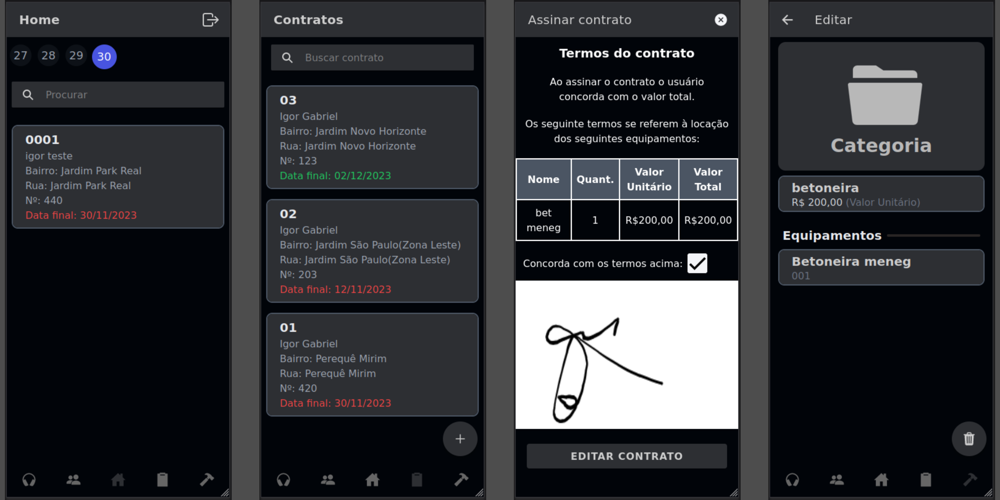
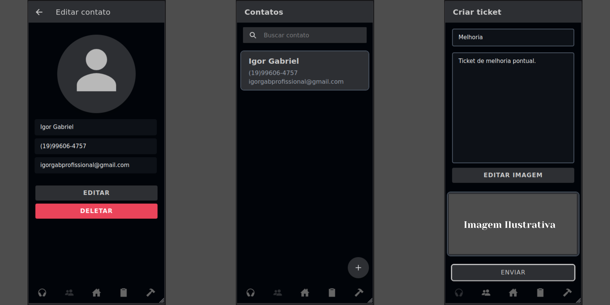

# RentApp - Aplicativo de Gerenciamento de Locações

---

Bem-vindo ao RentApp, um aplicativo completo para facilitar o gerenciamento de locações de equipamentos. Após um longo período de planejamento e desenvolvimento, estou animado em compartilhar o resultado final deste projeto.
## Visão Geral

O RentApp é uma aplicação dedicada a simplificar o processo de gerenciamento de locações, oferecendo funcionalidades robustas para criar contratos, exibir equipamentos associados a eles e permitir a assinatura digital. Além disso, o aplicativo inclui um filtro de calendário intuitivo que destaca os contratos próximos ao vencimento em datas específicas.
Principais Recursos

    Criação de Contratos: Utilize o RentApp para criar contratos de locação de forma eficiente, detalhando os equipamentos envolvidos.
    Assinatura Digital: Agilize o processo de formalização de contratos com a capacidade de assinatura digital integrada.
    Calendário de Vencimentos: Mantenha-se organizado com um calendário visual que destaca os contratos prestes a vencer em dias específicos.

---

---
 
## Tecnologias Utilizadas

****O RentApp foi desenvolvido com tecnologias modernas, proporcionando uma experiência eficiente e amigável:

    Ionic Angular: Utilizado para a estrutura do aplicativo, garantindo uma experiência de usuário consistente.
    Tailwind CSS: Responsável pela estilização do aplicativo, proporcionando um design atrativo e responsivo.
    Firebase: Adotado para gerenciar a autenticação, armazenamento de dados e imagens, garantindo segurança e eficiência no backend.****

---

## Próximos Passos

O RentApp estará em breve disponível na Google Play, proporcionando uma solução completa para o gerenciamento de locações. Esteja atento para futuras atualizações, pois planejo implementar melhorias e adições emocionantes.

Agradeço por seu interesse no RentApp e aguardo ansiosamente seu feedback à medida que continuamos aprimorando essa ferramenta. 😅

   <a href="https://drive.google.com/file/d/1ZasRhUcWSx3us9YVA5kRwZsXg9ysJGiE/view?usp=sharing">Click aqui para fazer dowload 🎉</a>

Atenciosamente, Igor Gabriel Martins Ramos